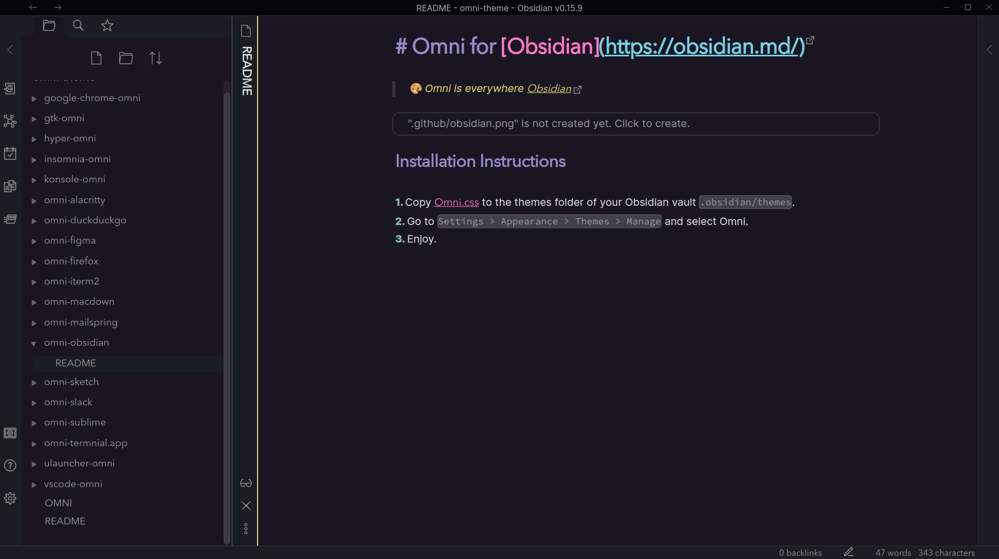

# Omni for [Obsidian](https://obsidian.md/)

> 🎨 Omni is everywhere [Obsidian](https://obsidian.md/)

## Installation Instructions

1. Copy [obsidian.css](./obsidian.css) to the themes folder of your Obsidian vault `.obsidian/themes`.
2. Go to `Settings > Appearance > Themes > Manage` and select Omni.
3. Enjoy.
